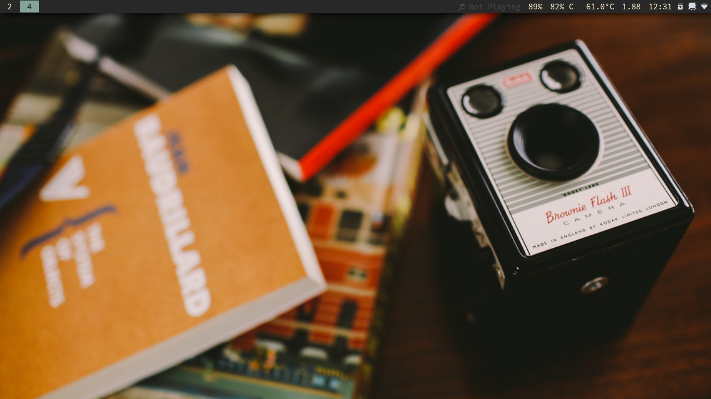

# Dotfiles

+ Window manager: i3wm.org
+ Gtk theme: https://github.com/system76/pop-gtk-theme
+ Icon theme: https://github.com/system76/pop-icon-theme
+ Color scheme: https://github.com/morhetz/gruvbox
+ Font: https://github.com/adobe-fonts
+ Launcher: https://github.com/DaveDavenport/rofi
+ Clipboard manager: https://github.com/erebe/greenclip
+ Playerctl: https://github.com/acrisci/playerctl
+ Lockscreen: https://github.com/meskarune/i3lock-fancy
+ Bonus: Infinality, redshift-gtk, transfer.sh, qrencode (transfer from pc to phone)
